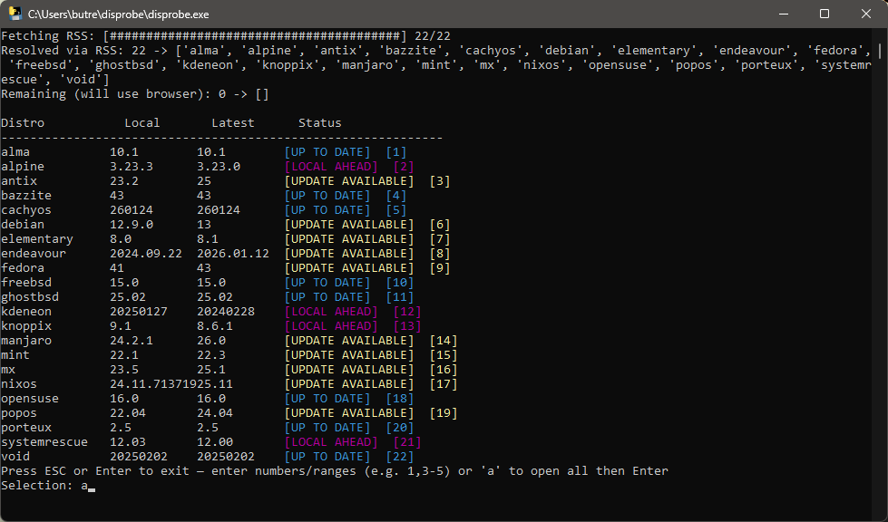

# disprobe

disprobe is a small command-line tool to check installed distro versions against upstream release sources (Distrowatch, RSS feeds, or arbitrary URLs). It was born to keep a Ventoy disk up-to-date but is generic enough to track any distribution release versions.



## Features
- RSS prefetch for speed and low load
- Playwright browser fallback for sites that require rendering
- Per-distro overrides: custom URL, feed, or regex extraction
- Filters and output formats: table, CSV, JSON
- Debug logging to JSON lines for easy tracing

## Requirements
- Python 3.10+
- Packages: playwright, httpx, colorama
- Playwright browsers (if not using `--no-browser`)

Install dependencies:
```
python -m pip install -r requirements.txt
python -m playwright install chromium
```
Note that releases have the requirements bundled and the program compiled to a single executable for windows.  compile flags are as follows
```pyinstaller --onefile --console disprobe.py```

Useful flags:
- `--no-browser`  do not attempt to fall back to Playwright
- `--csv <path>` / `--json <path>` - write outputs to csv or json
- `--help` - show additional flags
  
## Exit codes

- `0` — OK: Program completed without errors.
- `1` — CONFIG: Configuration error (missing or invalid config file).
- `2` — FATAL: Fatal runtime error (unexpected exception, Playwright or internal failure).
- `3` — NETWORK: Network error — all network fetches failed (e.g., Distrowatch or RSS unavailable).
- `4` — MULTIPLE: Multiple different issues occurred (catch-all for combined errors).
- `10` — PARTIAL_CONFIG: Partial configuration issues — some config lines were ignored or emitted warnings.
- `20` — PARTIAL_OTHER: Partial/fallback error — some runtime tasks failed while others succeeded.
- `30` — PARTIAL_NETWORK: Partial network failure — some distros returned `UNKNOWN` while others succeeded.
- `40` — PARTIAL_MULTIPLE: Multiple partial errors occurred while some distros succeeded (mixed partials).

## Config (distros.txt)
Plain text file, one distro per line:
- Format: `distro=local_version`
- Blank lines and `#` comments ignored
- Simple example:
```
fedora=43
ubuntu=22.04
alpine=3.18
```

Per-distro overrides (semicolon-separated metadata):
```
fedora=43;source=url;url=https://example.org/releases;regex=Release:\s.*?(\d+)
mydistro=1.2;source=rss;feed=https://example.org/feed.xml;regex=(\d+\.\d+)
```
Supported override keys:
- `source`: `distrowatch` (default), `rss`, or `url`
- `url` / `feed` / `uri`: explicit page or feed
- `regex`: a Python regex to extract the version

## Examples
Run without browser fallback, push debug to file:
```
python .\disprobe.py --no-browser --debug --debug-file debug.json
```

Write JSON output:
```
python .\disprobe.py --json results.json
```

## Debugging
Enable debug logging to capture events:
```
python .\disprobe.py --debug --debug-file debug.json
```
The JSON-lines file contains helpful events (rss_session_created, rss_prefetch, rss_http_status, playwright errors, etc.)

Common runtime issues
- Server-side blocking (403 / connection refused) - Distrowatch will block your connection for 10 hours if they think you're trying to DDoS them.  If you've got an extremely large list it's recommended to split your distros.txt into multiple parts and use the --file flag.
I went for what I thought was a good balance of speed and not getting hit with IP blocking but you may be able to find a better balance for your own use-case
